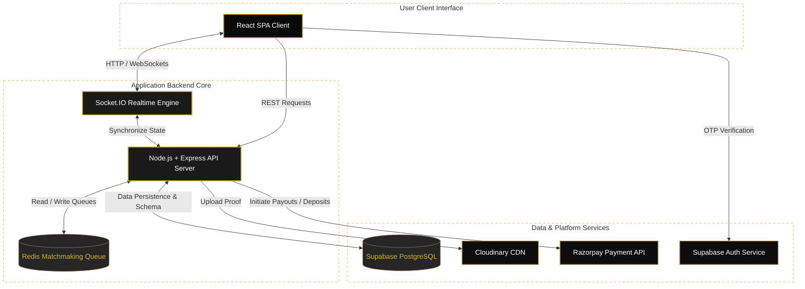

<div align="center">

# 👑 WINGAMES.CLUB

### **Premium Real-Money Ludo Matchmaking Platform**
*Deposit. Match. Play. Win. Redefined with security and speed.*

<br/>


<br/>
<br/>

[](https://react.dev)
[](https://nodejs.org)
[](https://expressjs.com)
[](https://supabase.com)
[](https://socket.io)
[](https://redis.io)
[](https://razorpay.com)

</div>

---

## 🔱 Overview

**WinGames.club** is an elite, mobile-first real-money Ludo battle arena. Players securely deposit funds, queue for real-time matchmaking against active opponents, engage in competitive matches, and verify results via secure screenshot uploads to receive payouts.

The application leverages a high-performance, production-ready backend framework designed around **trust, speed, and strict verification workflows**—featuring OTP authentication, comprehensive KYC verification, live matchmaking synchronization, and a full-featured wallet system.

> 🗲 **Client Project Showcase:** Fully architected system demonstrating end-to-end transaction integrity, authentication flows, and real-time state management.

---

## ⚜️ Features & Highlights

```
🔑 KYC & Verification  ──► Fully-validated age check and identity verification
📱 Passwordless Auth    ──► Swift Supabase Phone OTP-based authentication
💰 Secure Wallet        ──► Seamless deposits, withdrawals, and full ledger audits
⚡ Live Matchmaking     ──► Redis queues combined with Socket.IO for instant pairing
🎮 Game Room Management ──► Direct Room Code sharing for rapid game initiation
📸 Results Verification  ──► Screenshot evidence submission verified by platform admins
🔗 Referral Incentive   ──► Native viral loop giving users 2% of referred player wins
```

---

## 🖼️ UI Showcase

<table align="center" style="border: 2px solid #D4AF37; border-collapse: collapse; background-color: #0A0A0A;">
  <thead>
    <tr style="background-color: #1A1A1A; border-bottom: 2px solid #D4AF37;">
      <th align="center" style="padding: 10px; color: #D4AF37; font-weight: bold;">Match Verification</th>
      <th align="center" style="padding: 10px; color: #D4AF37; font-weight: bold;">Share & Invite</th>
      <th align="center" style="padding: 10px; color: #D4AF37; font-weight: bold;">KYC Verification</th>
    </tr>
  </thead>
  <tbody>
    <tr>
      <td align="center" style="padding: 8px; border: 1px solid #333;"></td>
      <td align="center" style="padding: 8px; border: 1px solid #333;"></td>
      <td align="center" style="padding: 8px; border: 1px solid #333;"></td>
    </tr>
    <tr style="background-color: #1A1A1A; border-bottom: 2px solid #D4AF37;">
      <th align="center" style="padding: 10px; color: #D4AF37; font-weight: bold;">Referral Dashboard</th>
      <th align="center" style="padding: 10px; color: #D4AF37; font-weight: bold;">Transaction Ledger</th>
      <th align="center" style="padding: 10px; color: #D4AF37; font-weight: bold;">Battle Arena</th>
    </tr>
    <tr>
      <td align="center" style="padding: 8px; border: 1px solid #333;"></td>
      <td align="center" style="padding: 8px; border: 1px solid #333;"></td>
      <td align="center" style="padding: 8px; border: 1px solid #333;"></td>
    </tr>
  </tbody>
</table>

---

## 📐 System Architecture

Below is the conceptual data and event flow map of **WinGames.club**:



---

## ⚙️ Tech Stack & Roles

| Service | Category | Functionality |
| :--- | :--- | :--- |
| **React** | Frontend | Highly responsive UI, optimized for mobile WebViews |
| **Node.js / Express** | Backend | Core RESTful API routing, business logic, validation |
| **Supabase** | DB & Identity | PostgreSQL schema enforcement & Secure Passwordless Phone Auth |
| **Socket.IO** | Realtime | Synchronous event loops for multiplayer game setup |
| **Redis** | Queue Management | Matchmaking queue memory broker ensuring quick pairing |
| **Cloudinary** | Media | Dynamic image storage for game results verification |
| **Razorpay** | Transactions | Secured payment gateway integration for user wallets |

---

## 🔄 Core User Flow

```
[Phone Auth] ➔ [Deposit Funds] ➔ [Join Redis Queue] ➔ [Get Room Code] ➔ [Play Match] ➔ [Upload Proof] ➔ [Receive Payout]
```

1. **Verify Identity:** Authenticate instantly with Phone OTP and complete KYC.
2. **Fund Wallet:** Load balance via secure Razorpay checkout gateway.
3. **Queue Up:** Enter matchmaking queue; Redis matches you with opponents of similar stakes.
4. **Acquire Room:** Socket.IO pushes a shared Room Code for the Ludo platform.
5. **Submit & Settle:** Snap and upload the winning screen. Admin panel clears validation to release the stakes.

---

## 📂 Project Structure

```
WINGAMES.CLUB/
├── client/           # Vite + React Frontend Application
│   ├── src/
│   │   ├── Components/
│   │   ├── Pages/
│   │   └── index.css # Styling Definitions
├── server/           # Express Server & Socket.IO Matchmaker
└── complete_schema.sql  # Database Schema & Functions
```

---

## 🚀 Installation & Local Setup

### 1. Clone & Access Project
```bash
git clone https://github.com/Shlokmonster/WINGAMES.CLUB.git
cd WINGAMES.CLUB
```

### 2. Install Client Dependencies
```bash
npm install
npm run dev
```

### 3. Setup Backend Environment
Initialize environment parameters (`.env`) inside the root directory:
```env
PORT=5000
SUPABASE_URL=your_supabase_url
SUPABASE_SERVICE_ROLE_KEY=your_service_role_key
REDIS_URL=your_redis_url
RAZORPAY_KEY_ID=your_razorpay_id
RAZORPAY_KEY_SECRET=your_razorpay_secret
CLOUDINARY_URL=your_cloudinary_url
```

---

## 👑 Developed By
Crafted with precision by **[@Shlokmonster](https://github.com/Shlokmonster)**. 

---

## ⚖️ Legal & Disclaimer
This repository is created exclusively for **portfolio and client presentation purposes**. All financial integrations rely on licensed client assets and sandboxed test environments. Verify and adhere to state-specific regulations on skill-based gaming in your region before using, adapting, or hosting this software.
